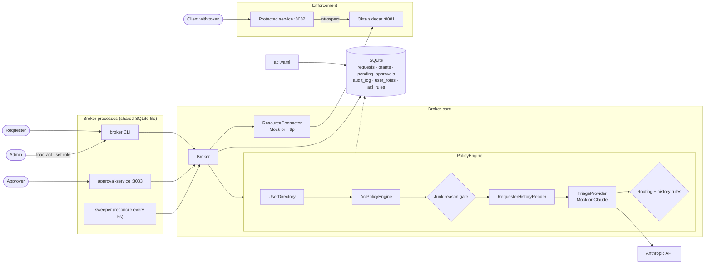
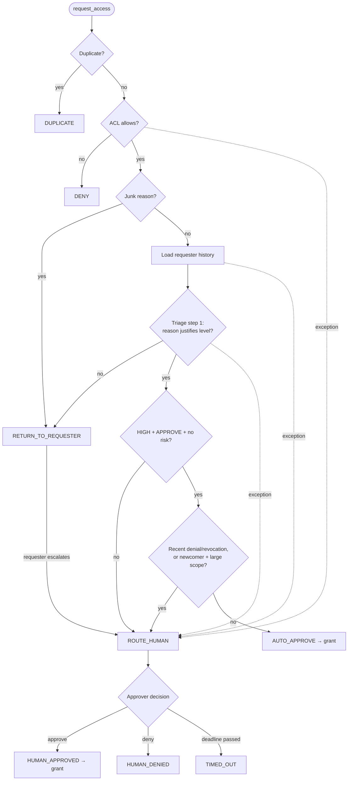
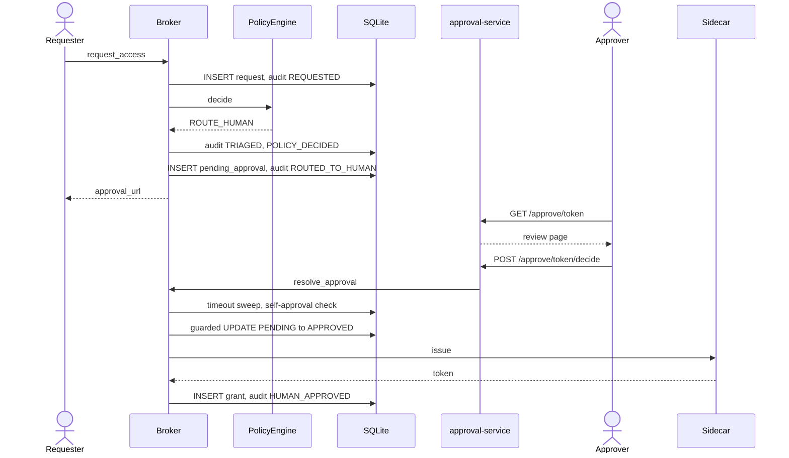
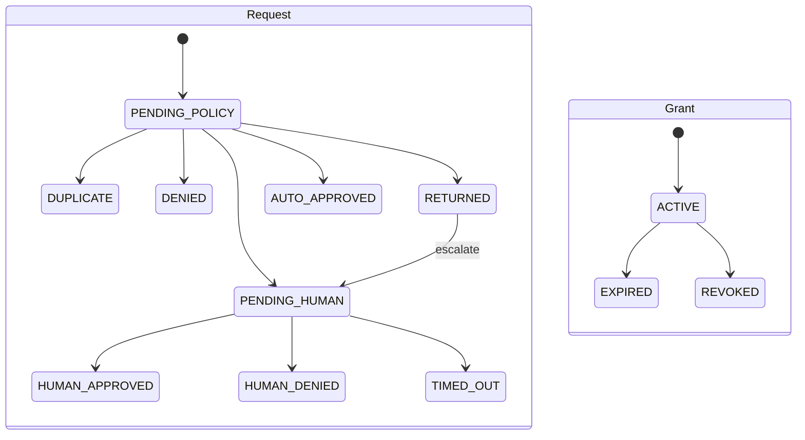

# Design

## System

## Decision pipeline

## Sequence: human approval

## State machines

## Key decisions

1. The ACL is a hard stop and runs before the AI. The AI never overrides it.
2. The AI may auto-approve only with HIGH confidence, APPROVE, and no risk flag. It never denies on its own.
3. A weak reason goes back to the requester, who can resubmit or escalate. It doesn't go to an approver.
4. Requester history only tightens a decision: a recent denial or revocation, or a newcomer asking for large scope, goes to a human.
5. Any exception in the pipeline routes to a human, never to an automatic approve or deny.
6. Routing is plain code, not a model call.
7. SQLite is the single source of truth. Guarded `UPDATE ... WHERE status=...` settles races.
8. Pending approvals time out after 4h and are auto-denied. The deadline is also checked at click time.
9. Duplicate requests (same requester, resource and level while one is active or pending) are rejected before policy runs.
10. Expiry and revocation call `connector.revoke`. The protected service checks the token with the sidecar on every request.
11. Every external dependency sits behind an interface: Policy, TriageProvider, ResourceConnector, UserDirectory, TokenIntrospector, Clock.

## Known limitations

- The approver's name is free text: it's authorization of a claimed name, not authentication.
- The protected service doesn't check the token's resource.
- Request status is set before `connector.issue`. If issue fails, the request shows approved with no grant.
- The duplicate check isn't atomic across processes.
- `connector.revoke` failure after the status change is not retried.
